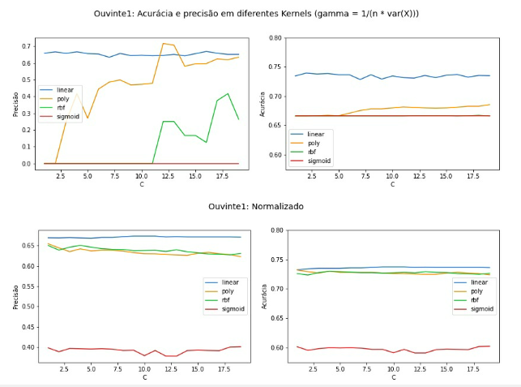
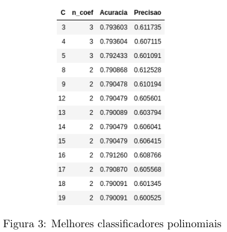

# Comparação de Classificadores

O trabalho se propõe a analisar metricas em dois diferentes  algoritmos. O  primeiro  deles é um gerador de  hipóteses gerais e estritas.  O segundo, mais robusto, é o SVC (support vector classifier)

## Resultados parciais do SVC

## Vídeo explicativo

`https://drive.google.com/drive/u/1/folders/1pEsoOlAXmntlGgW0ZVfpqj_dcQvwnePh`
